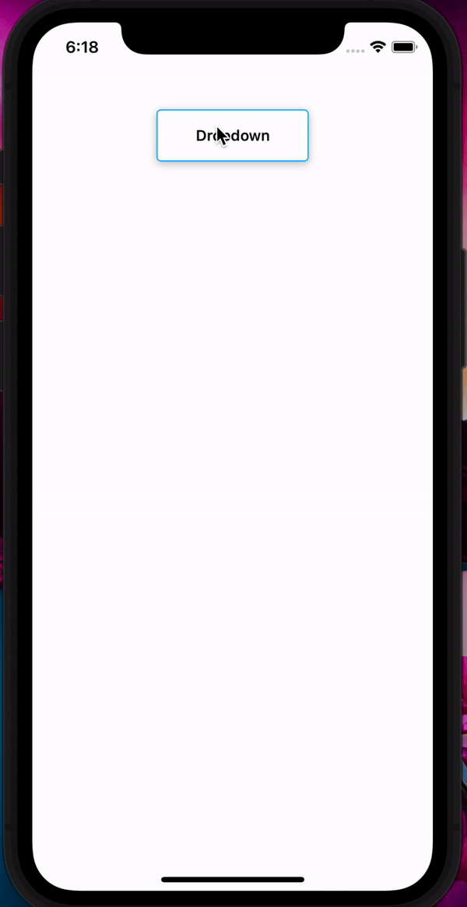
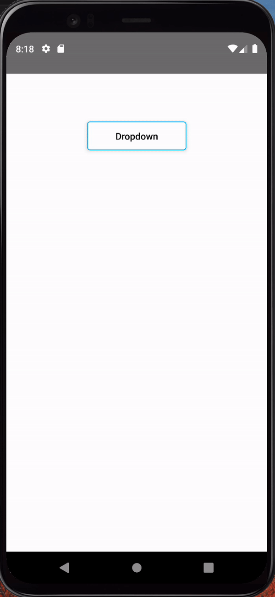

# React Native single selector

## Android

<br>

| iOS                             | Android                                  |
| ------------------------------- | ---------------------------------------- |
|  |  |

<br>

## Installation

### To use this component in your React Native project, install it via npm:

`npm i react-native-single-selector`

## Usage

### Import the NativeDropdown component in your code and incorporate it within your views. Below is a basic example:

```import React from "react";
import { View } from "react-native";
import NativeDropdown from "react-native-dropdown";

const MyComponent = () => {
  const optionData = [
    { key: 1, value: "Option 1" },
    { key: 2, value: "Option 2" },
    { key: 3, value: "Option 3" },
  ];

  const handleChange = (selectedOption) => {
    console.log("Selected option:", selectedOption);
  };

  return (
    <View style={{ flex: 1 }}>
      <NativeDropdown
        title="Select an option"
        optionData={optionData}
        onChangeText={handleChange}
      />
    </View>
  );
};

export default MyComponent;
```

## Props

```
● title (string): The text displayed on the dropdown button.

● optionData (array): An array of objects representing the options in the dropdown. Each object should have a key and value.

● onChangeText (function): Callback function triggered when an option is selected. It receives the selected option as a parameter.

● android_ripple_color (string, optional): Color for Android ripple effect. Defaults to "#ccc".

● showsVerticalScrollIndicator (boolean, optional): Whether to show the vertical scroll indicator in the dropdown. Defaults to false.

● rootStyle (object, optional): Additional styles for the root container.

● dropDownRootStyle (object, optional): Additional styles for the dropdown button.

● dropDownRootTextStyle (object, optional): Additional styles for the text inside the dropdown button.

● dropdownContainer (object, optional): Additional styles for the dropdown container.

● subDropdownContainer (object, optional): Additional styles for each individual dropdown option.
```

## Styling

`You can customize the component further by adjusting the styles using the available props. Refer to the style section of the source code for more details.`

## Example

`Check the provided example in the Usage section for a basic implementation. Feel free to customize the component according to your application's needs.`
